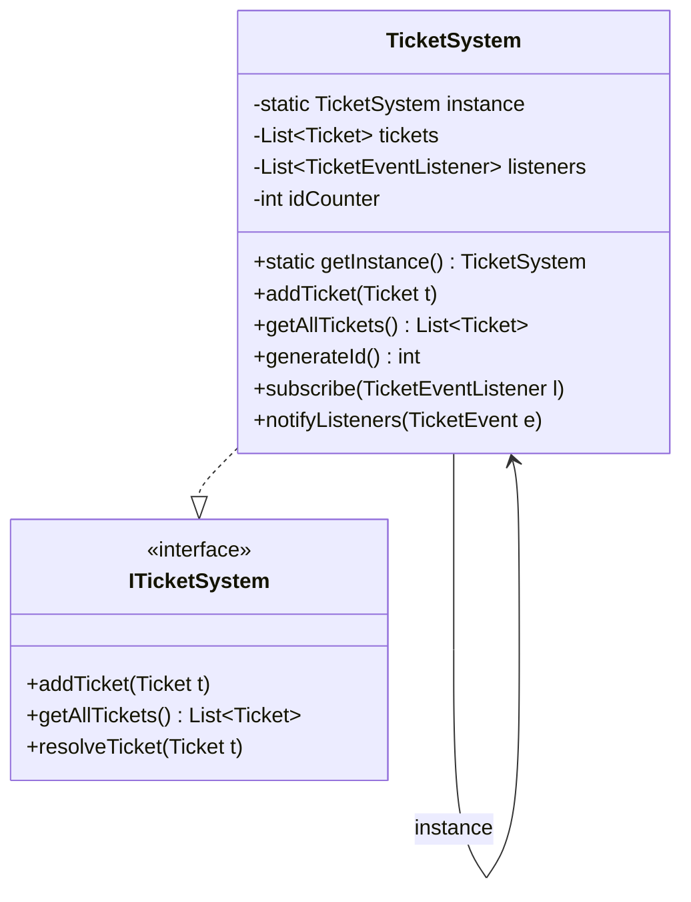
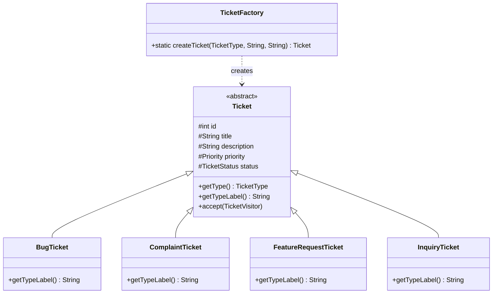
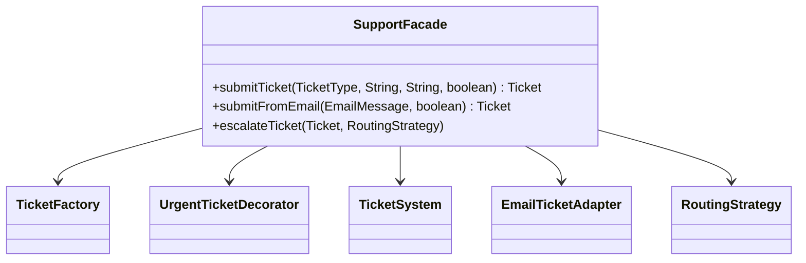
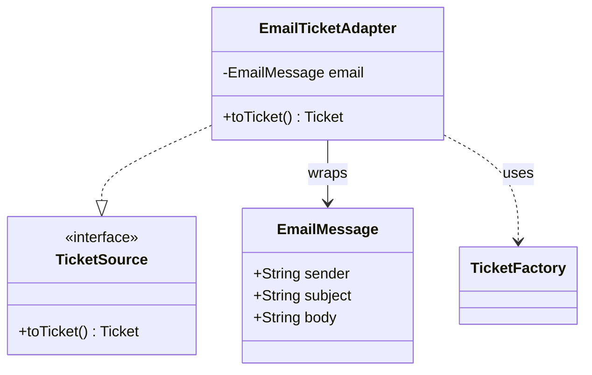
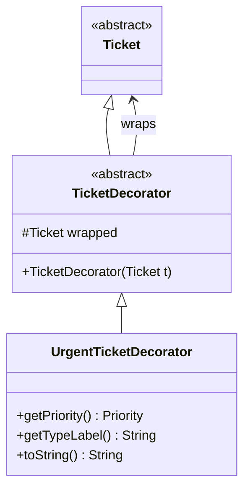

# AutoSupport — System Plan V3
## 10 Patterns | Class Tables | UML Per Pattern | Full System UML

---

## 0. Pattern Inventory (10 Patterns)

| # | Pattern | Category | Layer |
|---|---|---|---|
| 1 | Singleton | Creational | Core |
| 2 | Factory Method | Creational | Core |
| 3 | Facade | Structural | Entry Point |
| 4 | Adapter | Structural | Ingestion |
| 5 | Decorator | Structural | Enrichment |
| 6 | Proxy | Structural | Security |
| 7 | Chain of Responsibility | Behavioral | Escalation |
| 8 | Observer | Behavioral | Notifications |
| 9 | Strategy | Behavioral | Routing |
| 10 | State | Behavioral | Lifecycle |

> **Removed from V2:** Builder (Factory+setters sufficient), Visitor (simple loop reporting), Mediator (duplicated Chain logic)

---

## 1. Package Structure

```
AutoSupport/
├── Main.java
├── creational/
│   ├── singleton/
│   │   └── TicketSystem.java
│   └── factory/
│       ├── TicketFactory.java
│       ├── Ticket.java
│       ├── BugTicket.java
│       ├── ComplaintTicket.java
│       ├── FeatureRequestTicket.java
│       └── InquiryTicket.java
├── structural/
│   ├── facade/
│   │   └── SupportFacade.java
│   ├── adapter/
│   │   ├── EmailMessage.java
│   │   ├── TicketSource.java
│   │   └── EmailTicketAdapter.java
│   ├── decorator/
│   │   ├── TicketDecorator.java
│   │   └── UrgentTicketDecorator.java
│   └── proxy/
│       ├── ITicketSystem.java
│       ├── TicketSystemProxy.java
│       ├── UserRole.java
│       └── UserSession.java
├── behavioral/
│   ├── chain/
│   │   ├── SupportHandler.java
│   │   ├── Level1Handler.java
│   │   ├── Level2Handler.java
│   │   └── ManagerHandler.java
│   ├── observer/
│   │   ├── TicketEventListener.java
│   │   ├── TicketEvent.java
│   │   ├── TicketEventType.java
│   │   ├── LogPanelListener.java
│   │   ├── ConsoleNotificationListener.java
│   │   └── StatisticsListener.java
│   ├── strategy/
│   │   ├── RoutingStrategy.java
│   │   ├── StandardRoutingStrategy.java
│   │   ├── UrgentRoutingStrategy.java
│   │   └── TypeBasedRoutingStrategy.java
│   └── state/
│       ├── TicketState.java
│       ├── OpenState.java
│       ├── InProgressState.java
│       ├── EscalatedState.java
│       ├── ResolvedState.java
│       └── TicketContext.java
└── gui/
    └── MainGUI.java
```

---

## 2. Pattern Details

---

### 2.1 Singleton — TicketSystem

**Why Singleton and not a static class?**
A static class cannot implement an interface (`ITicketSystem`), cannot be injected as a dependency, and cannot be replaced with a mock in tests. Singleton gives one shared instance while remaining a proper object. We also extended it to hold the Observer subscriber list, making it the event bus hub of the system.

**Why not Multiton / Registry?**
There is exactly one support system — no keyed variants needed.

#### Class Table

| Class | Role | Connected To |
|---|---|---|
| `TicketSystem` | Single global registry; holds all tickets and Observer list | `ITicketSystem`, `TicketSystemProxy`, `TicketFactory`, `TicketEventListener` list |
| `ITicketSystem` | Interface that both real and proxy implement | `TicketSystem`, `TicketSystemProxy` |

#### UML — Singleton



---

### 2.2 Factory Method — TicketFactory

**Why Factory Method and not Abstract Factory?**
Abstract Factory creates *families* of related objects (e.g., GUI + Data + Network per platform). Here we have one product hierarchy — Ticket subtypes. Factory Method is the right fit: one factory, one product type, variant per enum value.

**Why not a simple constructor (`new BugTicket(...)`)?**
Direct construction scatters type-selection logic across the codebase. The Factory centralises it and assigns IDs from the Singleton, so callers never need to know either detail.

**Why not Prototype?**
Tickets are not costly to construct, and we need unique IDs per ticket — cloning would break ID uniqueness.

#### Class Table

| Class | Role | Connected To |
|---|---|---|
| `TicketFactory` | Static factory; switches on `TicketType` to return correct subclass | `TicketSystem` (for ID), `BugTicket`, `ComplaintTicket`, `FeatureRequestTicket`, `InquiryTicket` |
| `Ticket` | Abstract base; holds id, title, desc, priority, status | All ticket subclasses, `TicketDecorator`, `TicketContext`, `SupportHandler` |
| `BugTicket` | Concrete ticket — type BUG | `TicketFactory`, `SupportHandler` |
| `ComplaintTicket` | Concrete ticket — type COMPLAINT | `TicketFactory`, `SupportHandler` |
| `FeatureRequestTicket` | Concrete ticket — type FEATURE_REQUEST | `TicketFactory`, `SupportHandler` |
| `InquiryTicket` | Concrete ticket — type INQUIRY | `TicketFactory`, `SupportHandler` |

#### UML — Factory Method



---

### 2.3 Facade — SupportFacade

**Why Facade and not just calling classes directly from the GUI?**
The GUI would need to know about Factory, Decorator, TicketSystem, Observer, and State — six subsystems. That creates massive coupling. Facade offers one method per user action and hides all internal orchestration.

**Why not Mediator?**
Mediator is for *peer-to-peer* component coordination (bidirectional). Facade is strictly one-directional: GUI calls Facade; Facade calls subsystems. Subsystems never call back through the Facade.

**Why not Service Locator?**
Service Locator is an anti-pattern for test isolation. Facade is a proper structural pattern with a clear, narrow interface.

#### Class Table

| Class | Role | Connected To |
|---|---|---|
| `SupportFacade` | Single entry point for submit / escalate operations | `TicketFactory`, `UrgentTicketDecorator`, `TicketSystem`, `EmailTicketAdapter`, `RoutingStrategy`, `TicketContext` |

#### UML — Facade



---

### 2.4 Adapter — EmailTicketAdapter

**Why Adapter and not modifying EmailMessage directly?**
`EmailMessage` represents an *external* format (could be a third-party library or legacy system). We cannot and should not modify it. Adapter wraps it with no changes to the original class, converting it to the `Ticket` type the system expects.

**Why not Bridge?**
Bridge is a proactive, upfront abstraction designed before implementation. Adapter is reactive — it solves an existing incompatibility between two already-defined interfaces.

**Why not Decorator?**
Decorator adds behaviour to the *same* interface. Adapter converts *between* two different interfaces.

#### Class Table

| Class | Role | Connected To |
|---|---|---|
| `EmailMessage` | External data structure (sender, subject, body) | `EmailTicketAdapter`, `SupportFacade` |
| `TicketSource` | Target interface the system expects | `EmailTicketAdapter` |
| `EmailTicketAdapter` | Converts `EmailMessage` → `Ticket` via keyword detection | `EmailMessage`, `TicketFactory`, `SupportFacade` |

#### UML — Adapter



---

### 2.5 Decorator — UrgentTicketDecorator

**Why Decorator and not a boolean flag on Ticket?**
A boolean `isUrgent` on `Ticket` mixes urgency logic into the base class and into every subclass that overrides `getPriority()`. Decorator keeps urgency as a *wrapper* applied at runtime — no base class change, no combinatorial subclass explosion.

**Why not Strategy for urgency?**
Strategy swaps an *algorithm*. Urgency is not an algorithm; it is a runtime property that wraps and overrides specific methods of the same object.

**Why not inheritance (`UrgentBugTicket`, `UrgentComplaintTicket`, ...)?**
Four ticket types × two urgency levels = 8 classes minimum, and this explodes further with future additions.

#### Class Table

| Class | Role | Connected To |
|---|---|---|
| `TicketDecorator` | Abstract wrapper that holds a reference to another `Ticket` | `Ticket`, `UrgentTicketDecorator` |
| `UrgentTicketDecorator` | Overrides `getPriority()`, `getTypeLabel()`, `toString()` | `TicketDecorator`, `Ticket`, `SupportFacade` |

#### UML — Decorator


