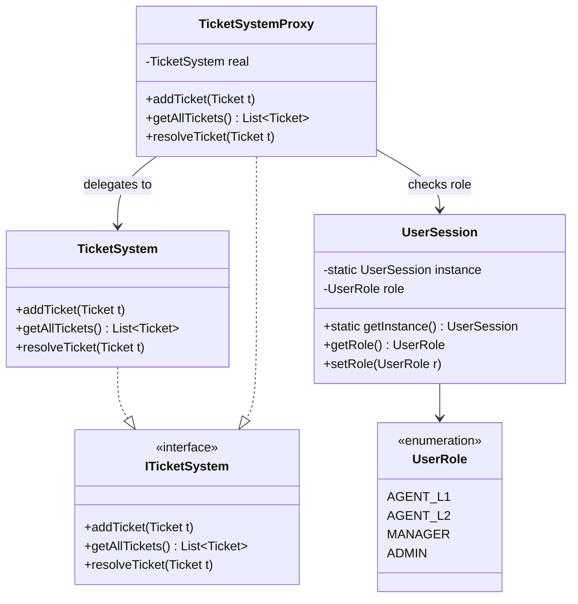
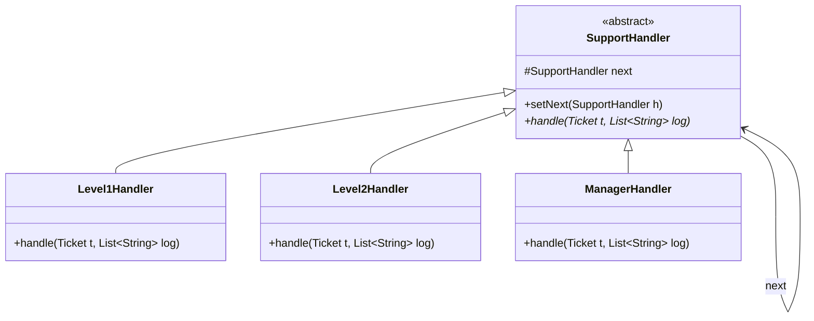
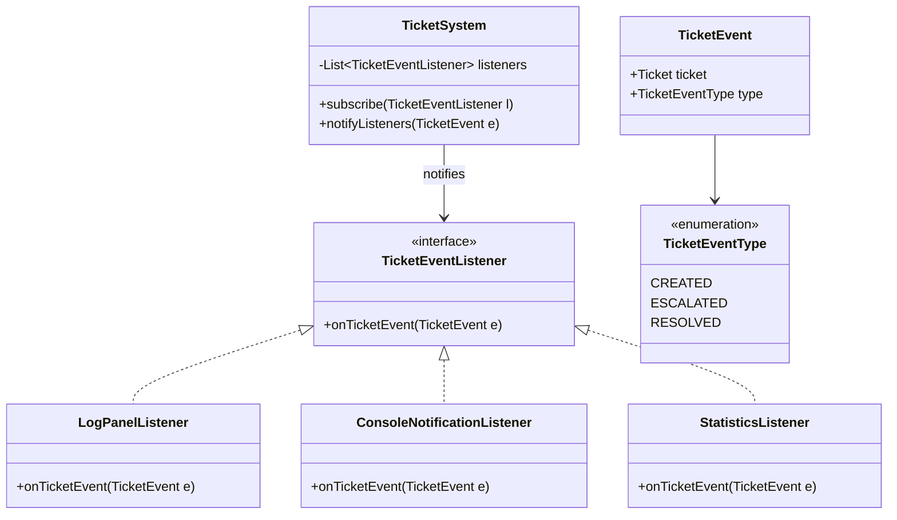
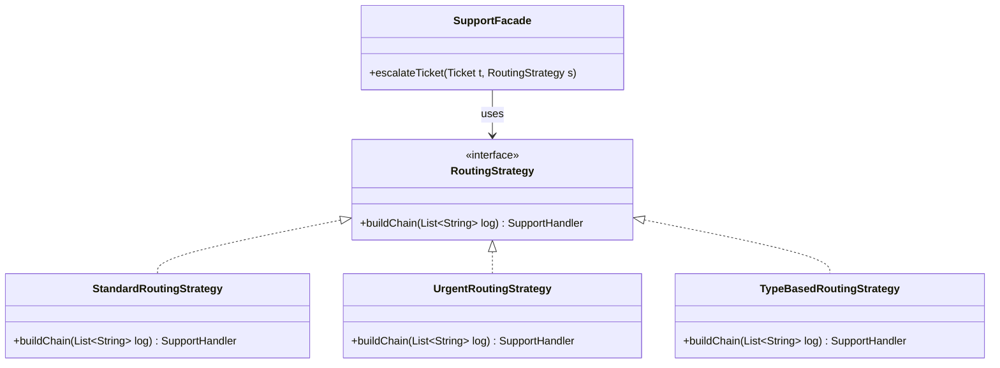
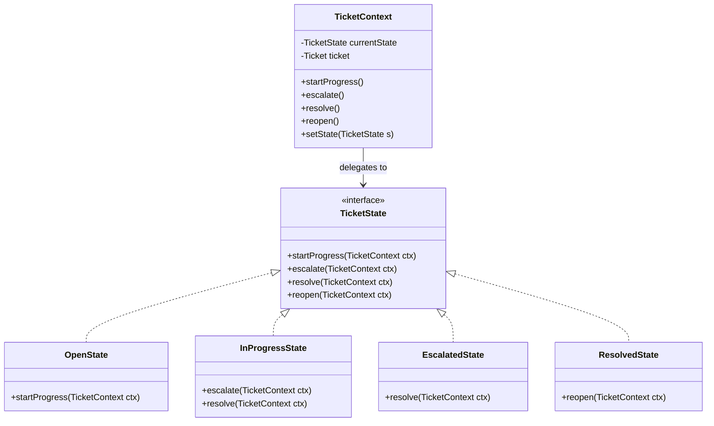

---

### 2.6 Proxy — TicketSystemProxy

**Why Proxy and not putting access checks inside TicketSystem?**
TicketSystem is the core domain object — it should store and retrieve tickets, nothing else. Mixing security logic into it violates the Single Responsibility Principle. Proxy intercepts calls *before* they reach the real object, enforcing role rules transparently.

**Why not Decorator for access control?**
Decorator adds *behaviour* to an object (e.g., logging, formatting). Proxy controls *access* to an object — a fundamentally different intent. The Gang of Four explicitly separate them.

**Why not putting checks in the GUI event handler?**
GUI checks are easily bypassed and scattered. A structural Proxy centralises all enforcement in one class regardless of which caller (GUI, test, API) invokes the system.

#### Class Table

| Class | Role | Connected To |
|---|---|---|
| `ITicketSystem` | Shared interface so GUI always programs to the interface | `TicketSystem`, `TicketSystemProxy` |
| `TicketSystemProxy` | Intercepts calls, checks `UserSession` role, then delegates | `ITicketSystem`, `TicketSystem`, `UserSession` |
| `UserSession` | Singleton holding the logged-in user and their `UserRole` | `TicketSystemProxy`, `MainGUI` |
| `UserRole` | Enum: `AGENT_L1`, `AGENT_L2`, `MANAGER`, `ADMIN` | `UserSession`, `TicketSystemProxy` |

#### UML — Proxy



---

### 2.7 Chain of Responsibility — Escalation Chain

**Why Chain of Responsibility and not a series of if-else in one class?**
A monolithic `if (type==INQUIRY) resolveL1() else if (type==BUG) resolveL2()...` is unmaintainable. Adding a new tier means editing the central class. Chain allows each handler to be an independent, closed class. New tiers are added by inserting a new link — no existing handler changes.

**Why not Strategy for escalation?**
Strategy *selects one algorithm* to run. Chain *tries handlers in sequence* and passes the request along until one handles it. These are fundamentally different flows — that is why we use both: Strategy *builds* the chain; Chain *runs* it.

**Why not Command?**
Command encapsulates a request as an object for undo/redo/queue purposes. Escalation is a pass-along pipeline, not a reversible command.

#### Class Table

| Class | Role | Connected To |
|---|---|---|
| `SupportHandler` | Abstract base with `setNext()` and `handle()` | `Level1Handler`, `Level2Handler`, `ManagerHandler` |
| `Level1Handler` | Resolves `INQUIRY` only; passes all others up | `SupportHandler`, `Ticket`, `TicketSystem` |
| `Level2Handler` | Resolves `BUG` and `FEATURE_REQUEST`; passes `COMPLAINT` up | `SupportHandler`, `Ticket`, `TicketSystem` |
| `ManagerHandler` | Final fallback — resolves everything | `SupportHandler`, `Ticket`, `TicketSystem` |

#### UML — Chain of Responsibility



---

### 2.8 Observer — Event Notification System

**Why Observer and not polling the TicketSystem from the GUI timer?**
Polling wastes CPU and introduces lag. Observer is event-driven: the moment a ticket is created, escalated, or resolved, all registered listeners are notified *immediately*. Each listener is independent and decoupled from the others and from `TicketSystem`.

**Why not Mediator?**
Mediator handles *bidirectional peer coordination* (components talk to each other through the mediator). Observer is *one-to-many broadcast* — the subject notifies listeners that never talk back. Mediator would be overkill and would introduce unnecessary coupling.

**Why not a direct GUI callback in TicketSystem?**
That would couple the domain core to a specific UI framework. Observer keeps `TicketSystem` framework-agnostic — it fires events to any listener, including console, stats bar, or future REST hook.

#### Class Table

| Class | Role | Connected To |
|---|---|---|
| `TicketEventListener` | Observer interface with `onTicketEvent()` | `TicketSystem`, all concrete listeners |
| `TicketEvent` | Value object carrying the ticket + event type | `TicketEventListener`, `TicketSystem` |
| `TicketEventType` | Enum: `CREATED`, `ESCALATED`, `RESOLVED` | `TicketEvent` |
| `LogPanelListener` | Appends formatted message to the GUI log panel | `TicketEventListener`, `MainGUI` |
| `ConsoleNotificationListener` | Prints simulated email/SMS to stdout | `TicketEventListener` |
| `StatisticsListener` | Increments open / escalated / resolved counters | `TicketEventListener`, `MainGUI` stats bar |

#### UML — Observer



---

### 2.9 Strategy — Routing Algorithm

**Why Strategy and not hardcoding the chain order in the Facade?**
Different escalation paths are needed at runtime: a standard ticket goes L1→L2→Manager, an urgent one skips L1, and a type-based one routes directly based on ticket category. Hardcoding these as `if` branches in the Facade violates OCP. Strategy encapsulates each routing algorithm as a swappable object.

**Why not Template Method?**
Template Method uses *inheritance* to override steps of a fixed skeleton. Strategy uses *composition* — the algorithm object is injected at runtime. The GUI lets the agent *pick* a routing strategy from a dropdown, which demands runtime swapping (Strategy), not subclass override (Template Method).

**Why not Chain alone (without Strategy)?**
Chain defines how handlers try in sequence. Strategy decides *which* chain to build and in *what order*. Without Strategy, every escalation uses the same hardcoded chain — no dynamic routing.

#### Class Table

| Class | Role | Connected To |
|---|---|---|
| `RoutingStrategy` | Interface: `buildChain(log)` returns first `SupportHandler` | `SupportFacade`, all concrete strategies |
| `StandardRoutingStrategy` | Builds L1 → L2 → Manager | `RoutingStrategy`, `Level1Handler`, `Level2Handler`, `ManagerHandler` |
| `UrgentRoutingStrategy` | Builds L2 → Manager (skips L1) | `RoutingStrategy`, `Level2Handler`, `ManagerHandler` |
| `TypeBasedRoutingStrategy` | Routes by ticket type: BUG→L2, INQUIRY→L1, COMPLAINT→Manager | `RoutingStrategy`, all handlers |

#### UML — Strategy



---

### 2.10 State — Ticket Lifecycle Machine

**Why State and not a status enum + if-else in setStatus()?**
A status enum requires every calling site to check what transitions are legal: `if (status == OPEN) status = IN_PROGRESS; else throw`. This logic scatters across every method that touches status. State encapsulates transition rules *inside each state class* — `OpenState` knows it can go to `InProgress`; `ResolvedState` knows it cannot escalate.

**Why not just a workflow engine / boolean flags?**
A workflow engine is external infrastructure. Boolean flags like `isOpen`, `isEscalated` can become inconsistent (`isOpen=true` and `isResolved=true` simultaneously). State guarantees that the ticket is always in exactly one valid state.

**Why not Strategy?**
Strategy swaps an algorithm. State controls which *operations are legal* from the current state and *drives transitions itself* — a different intent.

#### Class Table

| Class | Role | Connected To |
|---|---|---|
| `TicketState` | Interface: `startProgress`, `escalate`, `resolve`, `reopen` | All concrete state classes, `TicketContext` |
| `OpenState` | Allows `startProgress`; blocks escalate/resolve/reopen | `TicketState`, `TicketContext` |
| `InProgressState` | Allows `escalate` and `resolve`; blocks others | `TicketState`, `TicketContext` |
| `EscalatedState` | Allows `resolve` only | `TicketState`, `TicketContext` |
| `ResolvedState` | Allows `reopen` only | `TicketState`, `TicketContext` |
| `TicketContext` | Wraps a `Ticket`; delegates all actions to `currentState` | `TicketState`, `Ticket`, `SupportFacade` |

#### UML — State



---

## 3. Full System Class Table (All 36 Classes)

| # | Class | Package | Implements / Extends | Primary Role | Key Outgoing Relationships |
|---|---|---|---|---|---|
| 1 | `TicketSystem` | creational.singleton | `ITicketSystem` | Global registry + event bus | → `Ticket` list, → `TicketEventListener` list |
| 2 | `ITicketSystem` | structural.proxy | — | Shared interface | implemented by `TicketSystem`, `TicketSystemProxy` |
| 3 | `TicketFactory` | creational.factory | — | Creates typed Ticket subclasses | → `BugTicket`, `ComplaintTicket`, `FeatureRequestTicket`, `InquiryTicket`, → `TicketSystem` (ID) |
| 4 | `Ticket` | creational.factory | — | Abstract base entity | extended by all ticket types |
| 5 | `BugTicket` | creational.factory | `Ticket` | Bug variant | used by `TicketFactory`, `SupportHandler` |
| 6 | `ComplaintTicket` | creational.factory | `Ticket` | Complaint variant | used by `TicketFactory`, `SupportHandler` |
| 7 | `FeatureRequestTicket` | creational.factory | `Ticket` | Feature request variant | used by `TicketFactory`, `SupportHandler` |
| 8 | `InquiryTicket` | creational.factory | `Ticket` | Inquiry variant | used by `TicketFactory`, `SupportHandler` |
| 9 | `SupportFacade` | structural.facade | — | Single entry point for GUI | → `TicketFactory`, `UrgentTicketDecorator`, `TicketSystem`, `EmailTicketAdapter`, `RoutingStrategy`, `TicketContext` |
| 10 | `EmailMessage` | structural.adapter | — | External email data holder | → `EmailTicketAdapter` |
| 11 | `TicketSource` | structural.adapter | — | Target adapter interface | implemented by `EmailTicketAdapter` |
| 12 | `EmailTicketAdapter` | structural.adapter | `TicketSource` | Converts EmailMessage → Ticket | → `EmailMessage`, → `TicketFactory` |
| 13 | `TicketDecorator` | structural.decorator | `Ticket` | Abstract wrapper | → `Ticket` (wrapped) |
| 14 | `UrgentTicketDecorator` | structural.decorator | `TicketDecorator` | Marks ticket URGENT at runtime | → `TicketDecorator` |
| 15 | `TicketSystemProxy` | structural.proxy | `ITicketSystem` | Role-based access guard | → `TicketSystem`, → `UserSession` |
| 16 | `UserSession` | structural.proxy | — (Singleton) | Holds logged-in user role | → `UserRole` |
| 17 | `UserRole` | structural.proxy | — (enum) | Role constants | used by `UserSession`, `TicketSystemProxy` |
| 18 | `SupportHandler` | behavioral.chain | — | Abstract chain link | → `SupportHandler` (next) |
| 19 | `Level1Handler` | behavioral.chain | `SupportHandler` | Resolves INQUIRY | → `SupportHandler` (next), → `TicketSystem` |
| 20 | `Level2Handler` | behavioral.chain | `SupportHandler` | Resolves BUG, FEATURE_REQUEST | → `SupportHandler` (next), → `TicketSystem` |
| 21 | `ManagerHandler` | behavioral.chain | `SupportHandler` | Final fallback resolver | → `TicketSystem` |
| 22 | `TicketEventListener` | behavioral.observer | — | Observer interface | implemented by all listeners |
| 23 | `TicketEvent` | behavioral.observer | — | Event value object | → `TicketEventType`, → `Ticket` |
| 24 | `TicketEventType` | behavioral.observer | — (enum) | Event kind constants | used by `TicketEvent` |
| 25 | `LogPanelListener` | behavioral.observer | `TicketEventListener` | Writes to GUI log panel | → `MainGUI` log panel |
| 26 | `ConsoleNotificationListener` | behavioral.observer | `TicketEventListener` | Prints alerts to stdout | — |
| 27 | `StatisticsListener` | behavioral.observer | `TicketEventListener` | Updates stats bar counters | → `MainGUI` stats bar |
| 28 | `RoutingStrategy` | behavioral.strategy | — | Strategy interface | implemented by routing strategies |
| 29 | `StandardRoutingStrategy` | behavioral.strategy | `RoutingStrategy` | Builds L1→L2→Manager chain | → `Level1Handler`, `Level2Handler`, `ManagerHandler` |
| 30 | `UrgentRoutingStrategy` | behavioral.strategy | `RoutingStrategy` | Builds L2→Manager chain | → `Level2Handler`, `ManagerHandler` |
| 31 | `TypeBasedRoutingStrategy` | behavioral.strategy | `RoutingStrategy` | Routes by ticket type | → all handlers |
| 32 | `TicketState` | behavioral.state | — | State interface | implemented by all state classes |
| 33 | `OpenState` | behavioral.state | `TicketState` | Allows startProgress only | → `TicketContext` |
| 34 | `InProgressState` | behavioral.state | `TicketState` | Allows escalate / resolve | → `TicketContext` |
| 35 | `EscalatedState` | behavioral.state | `TicketState` | Allows resolve only | → `TicketContext` |
| 36 | `ResolvedState` | behavioral.state | `TicketState` | Allows reopen only | → `TicketContext` |
| 37 | `TicketContext` | behavioral.state | — | Delegates to current state | → `TicketState`, → `Ticket` |
| 38 | `MainGUI` | gui | — | Swing UI; wires all components | → `SupportFacade`, `TicketSystemProxy`, `UserSession` |
| 39 | `Main` | root | — | Entry point; registers observers | → `TicketSystem`, all listeners, `MainGUI` |

---

## 4. Full System UML (All Patterns Combined)

```mermaid
classDiagram
    %% ── CORE ──────────────────────────────────────────────────────────────
    class ITicketSystem { <<interface>> }
    class TicketSystem {
        -static instance
        -List~Ticket~ tickets
        -List~TicketEventListener~ listeners
        +getInstance()
        +addTicket()
        +subscribe()
        +notifyListeners()
    }
    class UserSession { -static instance; -UserRole role }
    class UserRole { <<enumeration>> }
    class TicketSystemProxy { -TicketSystem real }

    ITicketSystem <|.. TicketSystem
    ITicketSystem <|.. TicketSystemProxy
    TicketSystemProxy --> TicketSystem
    TicketSystemProxy --> UserSession
    UserSession --> UserRole

    %% ── FACTORY ──────────────────────────────────────────────────────────
    class Ticket { <<abstract>> }
    class BugTicket
    class ComplaintTicket
    class FeatureRequestTicket
    class InquiryTicket
    class TicketFactory

    Ticket <|-- BugTicket
    Ticket <|-- ComplaintTicket
    Ticket <|-- FeatureRequestTicket
    Ticket <|-- InquiryTicket
    TicketFactory ..> Ticket : creates

    %% ── DECORATOR ────────────────────────────────────────────────────────
    class TicketDecorator { #Ticket wrapped }
    class UrgentTicketDecorator
    Ticket <|-- TicketDecorator
    TicketDecorator <|-- UrgentTicketDecorator
    TicketDecorator --> Ticket

    %% ── ADAPTER ──────────────────────────────────────────────────────────
    class TicketSource { <<interface>> }
    class EmailMessage
    class EmailTicketAdapter
    TicketSource <|.. EmailTicketAdapter
    EmailTicketAdapter --> EmailMessage
    EmailTicketAdapter ..> TicketFactory

    %% ── FACADE ───────────────────────────────────────────────────────────
    class SupportFacade {
        +submitTicket()
        +submitFromEmail()
        +escalateTicket()
    }
    SupportFacade --> TicketFactory
    SupportFacade --> UrgentTicketDecorator
    SupportFacade --> TicketSystem
    SupportFacade --> EmailTicketAdapter
    SupportFacade --> TicketSystemProxy

    %% ── OBSERVER ─────────────────────────────────────────────────────────
    class TicketEventListener { <<interface>> }
    class TicketEvent
    class TicketEventType { <<enumeration>> }
    class LogPanelListener
    class ConsoleNotificationListener
    class StatisticsListener
    TicketEventListener <|.. LogPanelListener
    TicketEventListener <|.. ConsoleNotificationListener
    TicketEventListener <|.. StatisticsListener
    TicketSystem --> TicketEventListener : notifies
    TicketEvent --> TicketEventType

    %% ── STATE ────────────────────────────────────────────────────────────
    class TicketState { <<interface>> }
    class OpenState
    class InProgressState
    class EscalatedState
    class ResolvedState
    class TicketContext { -TicketState currentState }
    TicketState <|.. OpenState
    TicketState <|.. InProgressState
    TicketState <|.. EscalatedState
    TicketState <|.. ResolvedState
    TicketContext --> TicketState
    TicketContext --> Ticket
    SupportFacade --> TicketContext

    %% ── STRATEGY ─────────────────────────────────────────────────────────
    class RoutingStrategy { <<interface>> }
    class StandardRoutingStrategy
    class UrgentRoutingStrategy
    class TypeBasedRoutingStrategy
    RoutingStrategy <|.. StandardRoutingStrategy
    RoutingStrategy <|.. UrgentRoutingStrategy
    RoutingStrategy <|.. TypeBasedRoutingStrategy
    SupportFacade --> RoutingStrategy

    %% ── CHAIN ────────────────────────────────────────────────────────────
    class SupportHandler { <<abstract>> #SupportHandler next }
    class Level1Handler
    class Level2Handler
    class ManagerHandler
    SupportHandler <|-- Level1Handler
    SupportHandler <|-- Level2Handler
    SupportHandler <|-- ManagerHandler
    SupportHandler --> SupportHandler
    RoutingStrategy ..> SupportHandler : builds
```



---

## 5. Pattern Interaction Flow

```
User Action (GUI)
      │
      ▼
[Proxy] — checks UserSession.role → blocks if unauthorized
      │
      ▼
[Facade] — orchestrates:
      ├──► [Factory] → creates typed Ticket subclass
      ├──► [Adapter] → (email path) converts EmailMessage → Ticket
      ├──► [Decorator] → wraps with UrgentTicketDecorator if urgent
      └──► [Singleton] → registers ticket
                  │
                  ▼
           [Observer] — fires CREATED to all listeners
                  │
                  ▼
           [State] — TicketContext transitions lifecycle
                  │
                  ▼
           [Strategy] — selects & builds escalation chain
                  │
                  ▼
           [Chain] — L1 / L2 / Manager handle or pass up
                  │
                  └──► [Observer] fires ESCALATED or RESOLVED
```

---

## 6. Why NOT the Removed Patterns

| Removed | Why It Was Cut |
|---|---|
| **Builder** | `TicketFactory.createTicket()` + post-construction setters (`setSlaHours`, `addTag`) achieves the same optional-field construction without extra classes. Builder would add `TicketBuilder` + `TicketDirector` for minimal gain. |
| **Visitor** | Report generation is a simple `getAllTickets()` loop with a formatter utility class. Double-dispatch (requiring `accept()` in every Ticket subclass) is invasive boilerplate for a use case that a plain loop solves cleanly. |
| **Mediator** | Chain of Responsibility already handles the L1→L2→Manager handoff sequentially. Mediator would introduce `SupportHub`, `L1Agent`, `L2Agent`, `ManagerAgent` — 5 extra classes that duplicate what 3 Chain handlers already do with less coupling. |

---

*AutoSupport System Plan V3 — Part 2 of 2*
*10 Patterns | 39 Classes | 2026-05-09*
